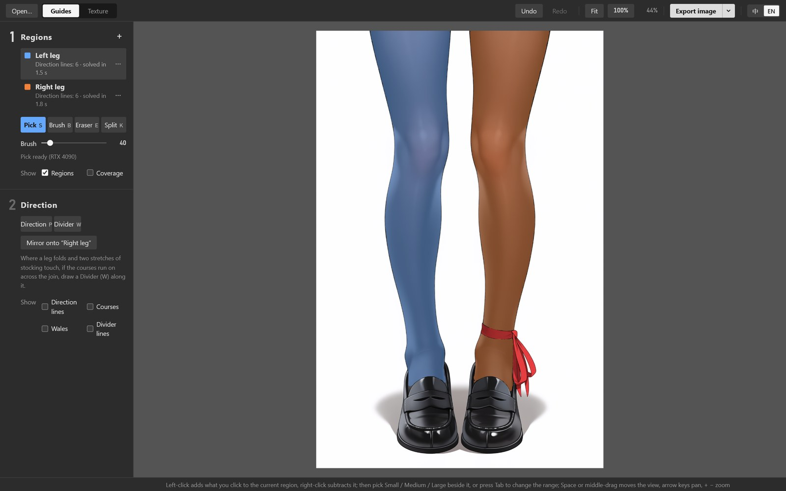
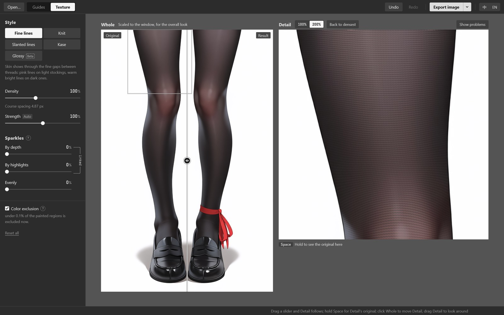

<p align="center"></p>

<h1 align="center">Stocking Texture Tool</h1>

<p align="center"><a href="README.md">中文</a> | English</p>

Adds a realistic knit texture to the stockings in an illustration. Roughly paint where the stockings are, draw a few lines along the knit, and the tool works out how the texture wraps around the legs and body and renders it in the style you pick, free of moiré. Everything runs on your own computer; nothing is uploaded.

<p align="center"></p>

<p align="center"><sub>Original left of the divider, processed right of it.</sub></p>

Black or white stockings alike (original on the left, processed on the right):


## What it does

- **A few lines texture a whole leg.** Draw 1–3 lines per region to say which way the knit runs; the courses fill the region, evenly spaced on screen. Where a hand or hair lies over the leg, they carry on underneath.
- **One click selects a leg.** Pick uses Segment Anything, with a Small / Medium / Large range to choose from after each click.
- **Five styles:** Fine lines, Knit, Slanted lines, Kase and Glossy (Beta). Each can add sparkles where the yarn catches the light.
- **Black or white stockings.** Strength follows the stockings' lightness: the same texture stands out about twice as much on white, so it is turned down there automatically.
- **No moiré.** Where the courses get close to a pixel apart the texture fades out by itself, and Show problems marks where that happens.
- **Mirror in one click.** Finish the left leg and the right one follows.
- **Three exports:** the finished image; a PNG of the stockings alone with everything else transparent (laid over the original it gives the finished image, handy as a Photoshop layer); and a guides PSD you can open again to keep working. Your own PSD is never written to.
- Chinese and English interface.

## Install

Windows 10 (1803 or later) or Windows 11. An NVIDIA card (RTX 20 series or newer, driver 570 or later) makes it much faster but is not required.

1. Get this repository: **Code → Download ZIP** at the top right and unzip it, or

   ```
   git clone https://github.com/silvermoong/stocking-texture-tool.git
   ```

2. Double-click `install.bat` in the folder. If Windows warns that the publisher can't be verified, or that it protected your PC, choose Run (or More info → Run anyway).

   Keep the folder's full path short (under 100 characters), for example `D:\stocking-texture-tool`.

The installer checks your graphics card and downloads what it needs from this project's [install files package](https://github.com/silvermoong/stocking-texture-tool/releases/tag/deps-1) on GitHub: its own Python 3.12, all the packages, the PyTorch build for your card and two models. Then it puts a "Stocking Texture Tool" shortcut on the desktop. You don't need Python installed, and any Python you have is left alone. The GPU build downloads about 3.3 GB, the CPU build about 740 MB; the GPU build takes about 5 GB installed.

Anything that fails to download from GitHub is fetched from its original source instead (PyPI, PyTorch, Hugging Face and so on).

Double-click the desktop icon to open the tool, or drop a picture or PSD on it.

- If the connection drops, run `install.bat` again; what has downloaded is kept.
- After updating your graphics driver, run it again to switch from the CPU build to the GPU build.
- To force the CPU build: `install.bat -Torch cpu`.
- **Uninstall:** delete the folder and the desktop shortcut. Settings and the auto-saved work are in `%LOCALAPPDATA%\StockingTexture`; delete that too if you like.

### Installing offline

If the install files download too slowly, or the computer has no internet connection, download them somewhere else first:

1. On the [install files package](https://github.com/silvermoong/stocking-texture-tool/releases/tag/deps-1) page, download `stt-deps-1-base.zip`, plus one PyTorch build:
   - NVIDIA card: `stt-deps-1-torch-cuda.zip.001` and `.002` (both)
   - any other PC: `stt-deps-1-torch-cpu.zip`
2. Put them in a `deps` folder next to `install.bat`. Or keep them in the same folder as the code zip, and extract the code where it lies.
3. Double-click `install.bat`; it needs no internet connection.

## How to use it

### 1. Open a picture

Drop a PNG, JPG or PSD on the window, or press Ctrl+O. A PSD is read as its flattened image.

### 2. Paint the regions



Step 1, Regions, on the left. There are two to start with, Left leg and Right leg.

- **Pick (S):** left-click a leg to select all of it; right-click subtracts. After a click, Small / Medium / Large appears beside it, and Tab switches between them. Fill in anything missed with another click at Small.
- **Brush (B) / Eraser (E):** touch up the edges by hand; `[` and `]` change the brush size.
- **Split (K):** draw a line across a region to cut it in two. A Snap to line art switch appears above the picture: with it on, the line snaps to nearby line art. If two breasts or two legs ended up in one region, Auto split there cuts it down the middle.

Give each side of a crease its own region: left and right thigh, crotch, left and right breast. It works beyond legs too, for instance a top split into collar, left chest and right chest:


### 3. Draw direction lines

Step 2, Direction: choose Direction (P) and draw a line along one course of the knit as you want it to run. Courses go round the leg, so on a leg you draw arcs across it, like the visible half of a ring around the leg.

- 1–3 lines per region are enough, each across about 80% of the region's width.
- **Lines set the direction, not the spacing.** However close or far apart you draw them, the course spacing comes from Density on the Texture page.
- Add a line wherever the direction changes a lot. Around something that bulges (a knee), draw ∩ above it and ∪ below to wrap it; around a hollow (the front of an ankle), the other way round, ∪ above and ∩ below:


- A line may cross a hand or hair; the courses carry on underneath.
- Right-click or Delete removes the line under the pointer. Each line re-solves only its own region, in a second or two.
- **Mirror:** once the left leg is done, click Mirror onto “Right leg” and the right leg gets a flipped copy of its lines, which you can then edit as usual.

With direction lines drawn on both legs, the thin white lines are the solved courses:


The top works the same way, its courses curving over the chest:


### 4. A folded leg

A leg bent double, its thigh resting on its calf, still needs only one region, with no seam at the knee. Draw a direction line on the thigh and one on the calf, then deal with the join and the knee in the two steps below.

With just the two direction lines, the thigh's courses run straight on into the calf:


**Thigh and calf each go their own way:** draw a Divider (W) along the line where thigh and calf touch. The courses part there, so the thigh and the calf can have direction lines running different ways.


**A smooth turn at the knee:** draw one more line on the knee, an arc roughly through its middle, curving as the knee bends. The courses follow it round the knee, joining the thigh's direction to the calf's smoothly.


After these three steps (Fine lines style, at the picture's own pixels):


Original on the left, processed on the right. At the knee, the courses follow the arc round it:


At the join of thigh and calf, the courses run different ways on either side:


Within one region, where one stretch of stocking lies in front of another with a clear step in depth, the tool tries to find the divider line itself and shows it dashed; right-click one that is wrong to delete it. Where two stretches touch, it usually can't tell, so draw those yourself.

### 5. Choose a style and adjust it

Switch to the Texture page at the top. The settings are on the left; Whole shows the full picture (drag the divider to compare with the original) and Detail shows a square at 100% or 200%, updating as you drag a slider. What Detail shows is exactly what gets exported.



**Styles**, left to right: Fine lines, Knit, Slanted lines, Kase, Glossy. Black stockings on top, white below (Glossy is meant for dark stockings, so the white row leaves it out):


| Style | Looks like |
| --- | --- |
| Fine lines (default) | Skin shows through a thin gap between wide threads: pink lines on light stockings, warm bright lines on dark ones |
| Knit | Columns of V-shaped stitch loops, like the reinforced sole of a stocking |
| Slanted lines | Fine slanting lines, leaning opposite ways on the two legs in a chevron |
| Kase | A fine, grainy knit |
| Glossy (Beta) | Sheer, shiny stockings: skin showing where the surface faces you, darker edges, a glint along the light. Best on plain black stockings with clear highlights; results can vary from picture to picture |

**Sliders**, each on the same patch of thigh:

Density 70% / 100% / 130%: how close the courses are


Strength 50% / 100% / 160%: how visible the texture is. Auto by default, from the stockings' lightness; turn it up by hand for dark clothes


Tilt 10° / 32° / 55°: Slanted lines only


Sparkles (Evenly) 0% / 100% / 300%


Sparkles come from several sources that mix: By depth puts them where the body bulges toward you (knees, the fronts of the legs), By highlights on the highlights the artist painted, and Evenly everywhere, for sequinned or glitter stockings.

**Color exclusion** (on by default): parts of a region whose color is far from the stocking's (gold trim, gloves, bare skin) get no texture. Now and then a sheer knee showing skin gets excluded too; turn it off then.

### 6. Show problems

Click Show problems above Detail. Red marks where the courses are so dense that the texture was faded to avoid moiré, blue what color exclusion removed, and yellow regions with no direction lines yet. If a main area has a large patch of red, lower the density:


On a small picture (832×1216, say) the course spacing soon reaches its lower limit, and the panel says how high the density can go on this picture. For denser texture, enlarge the picture 1.5× first.

### 7. Export

Click Export image at the top right. The arrow beside it switches to the other two kinds, and the button remembers your last choice (Ctrl+E does the same). Each export opens a save window where you choose the folder and the file name. It starts next to the original, then in the folder you last saved to; the suggested names are below, numbered (2), (3)… when that name is taken, so exporting several variants in a row never overwrites one. Picking an existing file asks before replacing it.

| Export | Suggested name | Use |
| --- | --- | --- |
| Finished image | `name-finished.png` | Use as is |
| Stockings only | `name-stockings-only.png` | The stockings alone, everything else transparent. Laid over the original it gives the finished image: one layer in Photoshop whose opacity or mask you can still change |
| Guides | `name-stocking-guides.psd` | Regions, direction lines and divider lines; drop it on the tool later to keep working |

The tool saves your work as you go: close it and it opens where you left off. Before opening another picture, it reminds you to export the guides if the current ones aren't saved anywhere.

## Common questions

**The courses run across the join between two stretches of stocking.** Draw a Divider (W) along the join.

**The texture is too faint or too strong.** Adjust Strength. Dark clothes and dark stockings can be faint at the default.

**There's a large red "Faded" patch.** Lower the density, or enlarge the picture and process it again.

**Pick isn't working.** Its status and the reason show under the brush slider in step 1. If a model file is missing, run `install.bat` again.

**Does it work without an NVIDIA card?** Yes. Pick needs two or three seconds to analyse each picture and depth one or two; everything else is as fast as with a GPU, since solving and rendering run on the CPU anyway.

## How it works

- **Where the courses come from:** the directions of your lines are interpolated smoothly over the region into a direction field, and a least-squares solve turns it into a coordinate whose gradient is 1 everywhere. The courses are its contour lines, so they are evenly spaced on screen and follow your lines. Holes left by hands and hair are filled in for the solve, so the courses are continuous underneath them.
- **Following the body:** the texture multiplies the painted image, so all the artist's light and shade stays; the gaps in Fine lines and Knit take their color from how light the stocking is around them, so they change naturally where skin shows through; By depth sparkles go where the body bulges.
- **No moiré:** every stripe fades out before its local frequency nears the pixel limit; small patterns like stitch loops are sampled from pre-averaged multi-level tiles, which average to grey rather than alias when dense; sparkles are random single pixels.
- **The depth model** finds where one stretch of stocking lies in front of another, and places the By depth sparkles.

## Third-party components

The installer downloads these two models; they are not in the repository:

- [Segment Anything](https://github.com/facebookresearch/segment-anything) ViT-B (Meta, Apache-2.0): Pick
- [Depth Anything V2 Small](https://huggingface.co/depth-anything/Depth-Anything-V2-Small-hf) (Apache-2.0): depth

It also uses PyTorch, Transformers, OpenCV, NumPy, SciPy, psd-tools, FastAPI and others, installed with [uv](https://github.com/astral-sh/uv).

## Development

```
.tools\uv pip install --python .venv\Scripts\python.exe -r requirements-dev.txt
.venv\Scripts\python -m pytest
```

Some tests need a sample picture that is not distributed with the code; without it they are skipped. See [tests/sample_data.py](tests/sample_data.py).

After changing a dependency's version (`requirements*.txt`), rebuild the install files package: `.venv\Scripts\python tools\make_deps.py deps-2`, upload what it makes to a new GitHub release `deps-2`, and commit the updated `tools/deps.json`.

## License

The code is under the [MIT License](LICENSE). The example pictures in this README were generated by the author.
