<p align="center">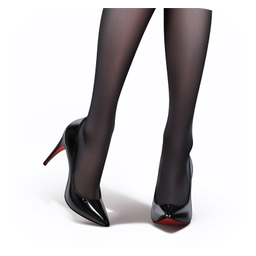</p>

<h1 align="center">丝袜纹理工具</h1>

<p align="center">中文 | <a href="README.en.md">English</a></p>

给插画里的丝袜加上真实的织物纹理。粗涂出丝袜在哪，沿横纹画几条线，工具就算出纹理怎样绕着腿和身体走，按你选的样式渲染出来，没有摩尔纹。全程在本机运行，不上传任何东西。

<p align="center">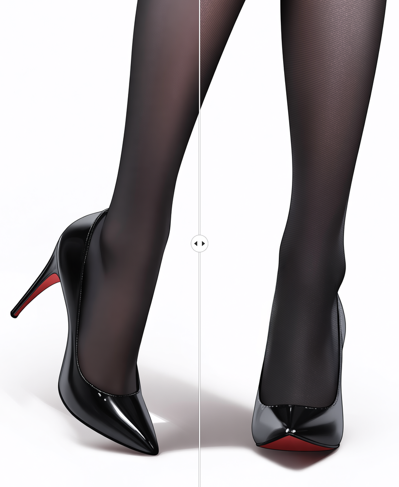</p>

<p align="center"><sub>分界线左边是原图，右边是处理后。</sub></p>

白丝黑丝都可以（左边原图，右边处理后）：

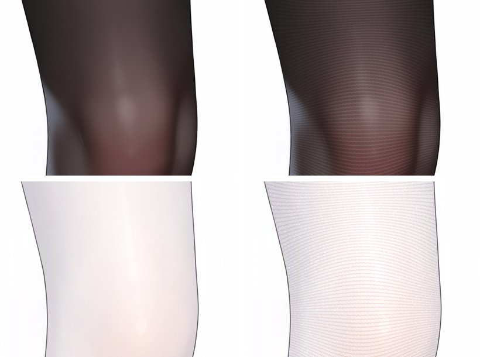

## 能做什么

- **几条线铺满整条腿。** 每个部位画 1–3 条线告诉它横纹往哪走，横纹自动铺满，在屏幕上处处等距。手、头发挡住的地方，横纹在下面连续走。
- **点一下选出一条腿。** 点选用 Segment Anything，点完可以在小 / 中 / 大三档范围里挑。
- **五种样式：** 细线、针织、斜单线、加濑风、油光（试验）。每种都能加纱线反光的亮点。
- **白丝黑丝都行。** 强度按丝袜深浅自动设定：同样的纹理在白丝上显眼一倍，白丝会自动调低。
- **不出摩尔纹。** 横纹太密、接近像素大小的地方，纹理会自动减弱；「标出问题」会把这些地方标出来。
- **左右一键镜像。** 左腿画好，右腿点一下就有。
- **三种导出：** 成品图；只有丝袜、其余透明的 PNG（叠在原图上就等于成品图，方便在 Photoshop 里当图层）；丝袜引导 PSD（以后可以再打开接着改）。你自己的 PSD 永远不会被改写。
- 中文 / English 界面。

## 安装

需要 Windows 10（1803 以上）或 Windows 11。有 NVIDIA 显卡（RTX 20 系或更新、驱动 570 以上）会快很多，没有也能用。

1. 下载这个仓库：点右上角 **Code → Download ZIP** 解压，或者

   ```
   git clone https://github.com/silvermoong/stocking-texture-tool.git
   ```

2. 双击文件夹里的 `install.bat`。Windows 可能提示「无法验证发布者」或「Windows 已保护你的电脑」，点「运行」，或者「更多信息 → 仍要运行」。

   文件夹的完整路径不要太长（100 个字符以内），比如放在 `D:\stocking-texture-tool`。

安装程序会检测显卡，从本项目 GitHub 上的[安装文件包](https://github.com/silvermoong/stocking-texture-tool/releases/tag/deps-1)下载需要的文件：一个独立的 Python 3.12、全部依赖、对应显卡的 PyTorch 和两个模型。最后在桌面建一个「丝袜纹理工具」快捷方式。电脑上不需要事先装 Python，也不会动你已有的 Python。显卡版要下载约 3.3 GB，CPU 版约 740 MB，装完显卡版约占 5 GB。

GitHub 下载失败的文件，会改从各自的原始来源下载（PyPI、PyTorch、Hugging Face 等）。

装好后双击桌面图标打开。也可以把图片或 PSD 直接拖到图标上。

- 中途断网了，重新运行 `install.bat` 即可，已经下载的部分不会重复下载。
- **更新：** 再运行一次 `install.bat`。它会先把代码更新到 GitHub 上的最新版（下载 ZIP 的直接替换有变化的文件；`git clone` 的用 git 快进，不会覆盖你自己改过的文件），再补装新版需要的依赖和模型。连不上 GitHub 时照常安装手上的代码。不想更新：`install.bat -NoUpdate`。
- 更新显卡驱动后再运行一次，会从 CPU 版换成显卡版。
- 想强制用 CPU：`install.bat -Torch cpu`。
- **卸载：** 删掉这个文件夹和桌面快捷方式。设置和自动保存的工作在 `%LOCALAPPDATA%\StockingTexture`，也可以一起删。

### 离线安装

安装文件包下载太慢，或者安装的电脑不能联网时，先在别处把文件下好：

1. 打开[安装文件包](https://github.com/silvermoong/stocking-texture-tool/releases/tag/deps-1)，下载 `stt-deps-1-base.zip`，再按显卡选一种 PyTorch：
   - NVIDIA 显卡：`stt-deps-1-torch-cuda.zip.001` 和 `.002`，两个都要
   - 其他电脑：`stt-deps-1-torch-cpu.zip`
2. 在 `install.bat` 旁边新建一个 `deps` 文件夹，把下载的文件原样放进去。**不用解压，也不要改文件名**，安装程序会自己拼接、校验和解压。
3. 双击 `install.bat`，全程不用联网。

## 使用

### 1. 打开图片

把 PNG、JPG 或 PSD 拖进窗口，或者按 Ctrl+O。PSD 取合成后的画面。

### 2. 涂部位

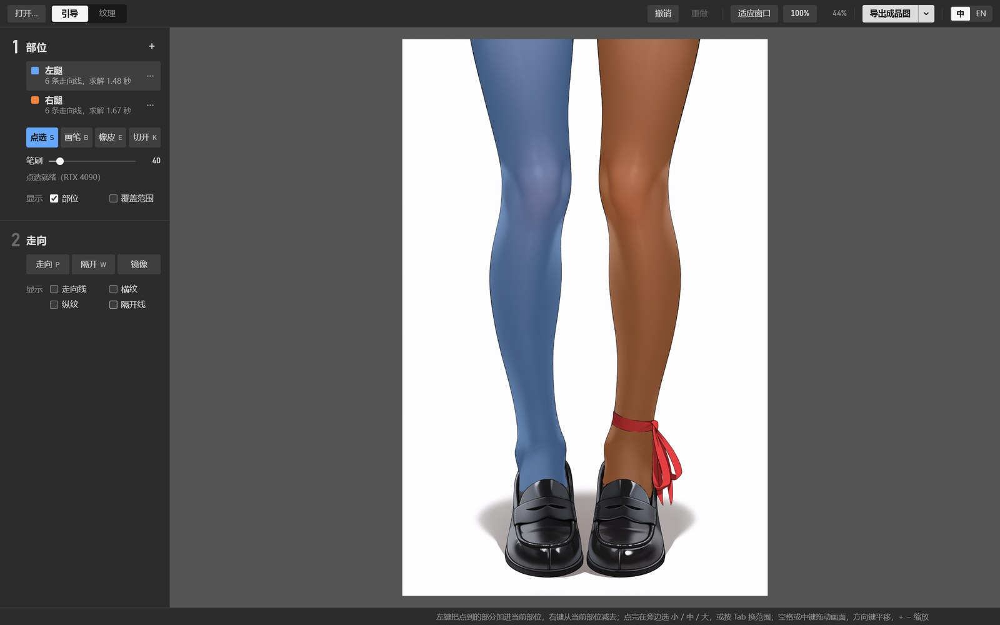

左边第 1 步「部位」。默认已经有「左腿」「右腿」两个部位。

- **点选（S）：** 在腿上左键点一下，整条腿就选进来；右键减去。点完旁边会出现「小 / 中 / 大」，按 Tab 切换范围。漏掉的地方用小档再点一下补上。
- **画笔（B）/ 橡皮（E）：** 手动修边，`[` `]` 调笔刷大小。
- **切开（K）：** 在部位上画一条线，分成两块。画面上方会出现「自动贴线」开关，打开后线会吸到附近的线稿上。两胸或两条腿选在了一起，点那里的「自动分割」，会沿中线分开。

凡是有折痕的地方，两边各用一个部位：左右大腿、胯部、左右胸。腿以外也一样能用，比如一件上衣切成领子、左胸、右胸三块：

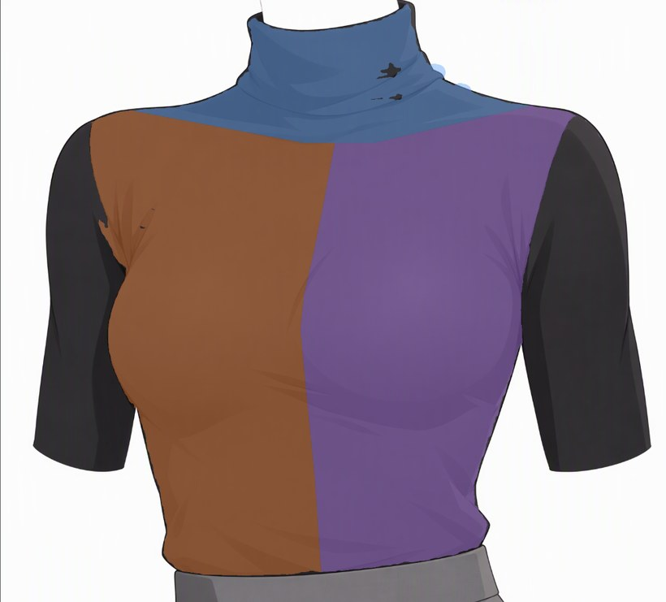

### 3. 画走向线

左边第 2 步「走向」，选「走向（P）」，沿着你想要的一道横纹画一条线。横纹是绕着腿一圈一圈的线，所以在腿上画的是横穿过腿的弧线，像腿上套着的环看得见的那半圈。

- 每个部位 1–3 条就够，每条横跨部位宽度的大约八成。
- **线只管方向，不管疏密。** 画得密还是稀都一样，横纹间距由纹理页的「密度」决定。
- 方向变化大的地方各补一条。凸起的地方（膝盖）上方画 ∩、下方画 ∪，把它包住；凹进去的地方（脚踝正面）反过来，上方 ∪、下方 ∩：

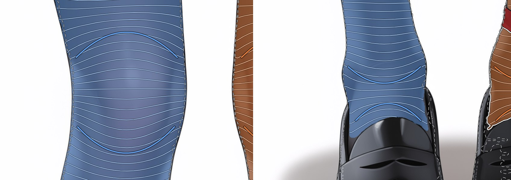

- 线可以横穿手或头发，横纹会在下面接着走。
- 右键或 Delete 删掉指针下的线。每画一条只重算这一个部位，一两秒就好。
- **镜像：** 左腿画好后，选中左腿点「镜像」，右腿就有了一套翻转过来的线，之后可以照常修改。

两条腿画好走向线后，白色细线是算出来的横纹：

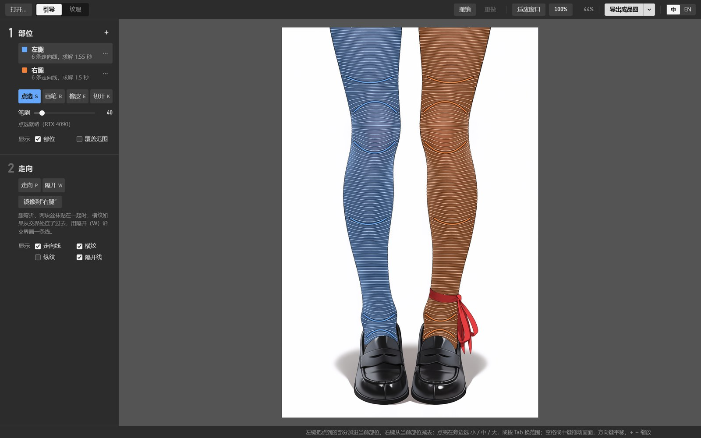

上衣也一样，横纹顺着胸部的弧度弯曲：


### 4. 弯折的腿

一条腿弯折、大腿压着小腿时，用一个部位就够，膝盖处没有接缝。大腿和小腿各画一条走向线，再按下面两步处理交界和膝盖。

只画两条走向线时，大腿的横纹会直接串进小腿：


**大腿和小腿各走各的：** 用「隔开（W）」沿大腿和小腿贴在一起的交界画一条线。两边的横纹在交界处分开，大腿和小腿可以画不同方向的走向线。


**膝盖处平顺过渡：** 在膝盖上再画一条弧线，大致放在膝盖中间，弧度和膝盖的弯折一样。横纹会沿着它绕过膝盖，把大腿和小腿两种方向平顺地接起来。

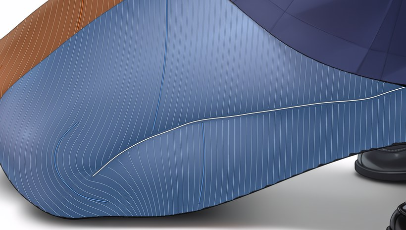

按这三步处理后（细线样式，原图像素）：

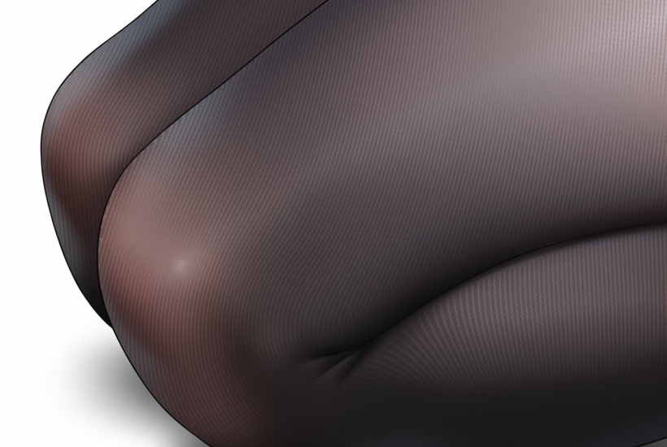

左边原图，右边处理后。膝盖处的横纹沿弧线绕过去：

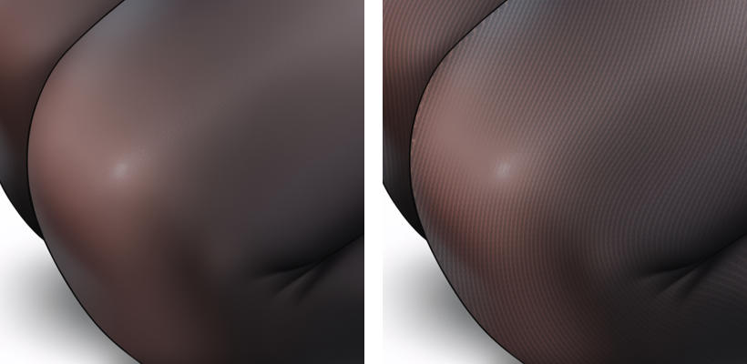

大腿和小腿的交界，两侧的横纹方向不同：

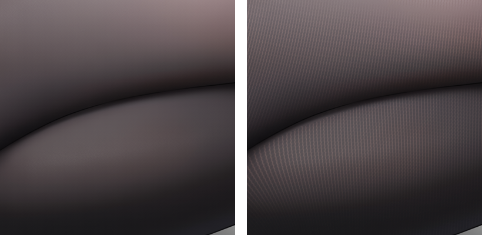

同一个部位里，一块丝袜挡在另一块前面、深度上有明显落差的地方，工具会尽量自动找出隔开线，显示为虚线；找错了右键删掉。贴在一起的交界一般找不到，要自己画。

### 5. 选样式、调参数

切到顶部的「纹理」页。左边是参数，中间「整体」看全图（拖中间的分界线对比原图），右边「细节」放大到 100% 或 200%，拖滑杆时实时更新。细节里看到的就是导出的像素。

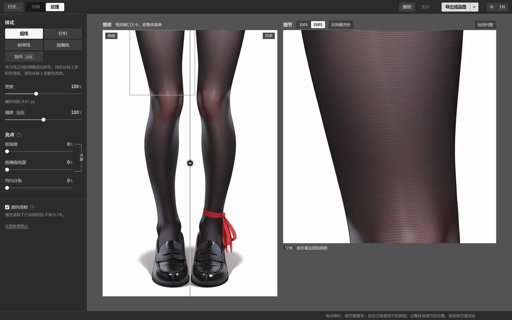

**样式**，从左到右：细线、针织、斜单线、加濑风、油光。上黑丝，下白丝（油光是给深色丝袜用的，白丝那行没有放）：

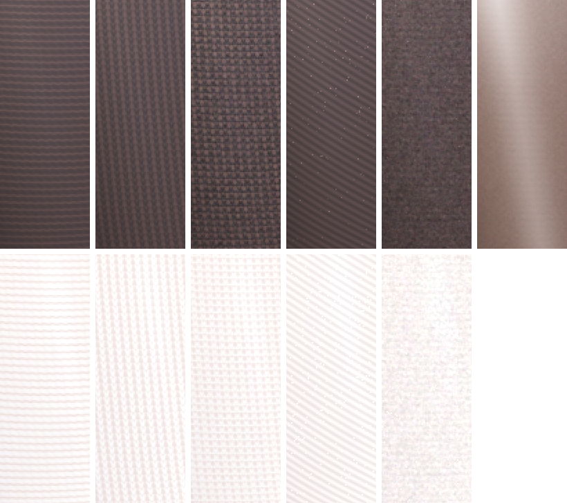

| 样式 | 样子 |
| --- | --- |
| 细线（默认） | 宽纱线之间一道细缝透出肤色：浅色丝袜上是粉色细线，深色丝袜上是暖色亮线 |
| 针织 | 一列列 V 形线圈，像丝袜脚底加厚部分的织法 |
| 斜单线 | 斜着走的细线，两条腿方向相反，成人字形 |
| 加濑风 | 细碎的颗粒感针织 |
| 油光（试验） | 半透明的油亮丝袜：正对处透肤、边缘发暗、受光处一条反光。适合有明显高光的纯色黑丝，换一张图效果可能不稳定 |

**滑杆**，每张都是同一块大腿：

密度 70% / 100% / 130%：横纹的疏密

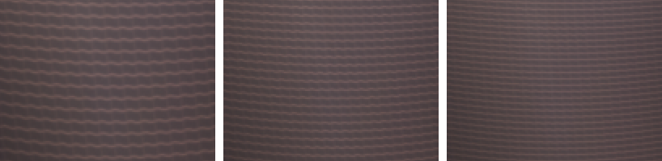

强度 50% / 100% / 160%：纹理有多明显，不影响亮点（亮点由下面的亮点滑杆单独控制）。默认「自动」，按丝袜深浅设定；深色衣服可以手动调高

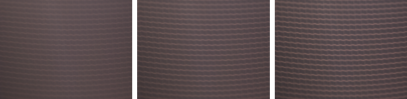

斜度 10° / 32° / 55°：只在斜单线样式里出现

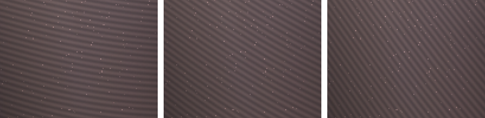

亮点（均匀分布）0% / 100% / 300%

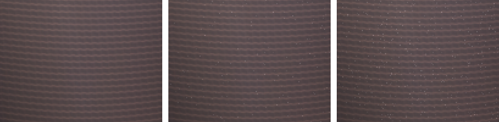

亮点有几个来源，可以混用：「按深度」撒在鼓起的地方（膝盖、腿正面），「按画面亮部」撒在画好的高光上，「均匀分布」到处都撒，适合亮片丝。

**颜色排除**（默认开）：部位里颜色和丝袜差得远的地方（金边、手套、露出的皮肤）不加纹理。薄丝袜透肤的膝盖偶尔会被误排除，这时把它关掉。

### 6. 标出问题

点细节上方的「标出问题」，红色是横纹太密、为了不出摩尔纹被减弱的地方，蓝色是颜色排除掉的地方，黄色是还没画走向线的部位。主要区域有大块红色，就把密度调低：

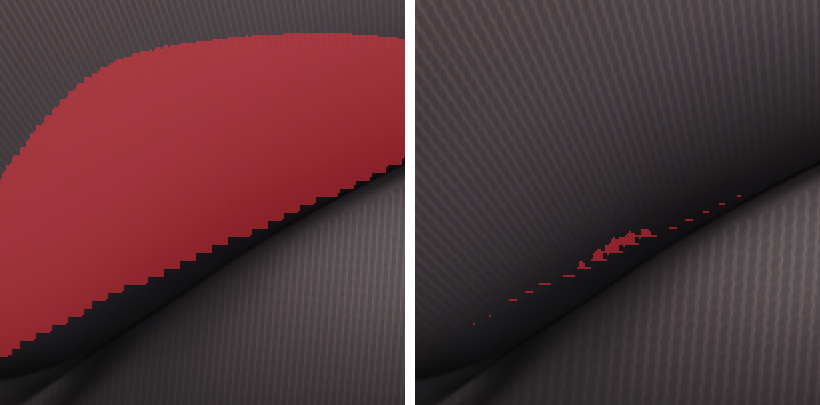

小图（比如 832×1216）横纹间距很快会碰到下限，界面会提示这张图最多能到多少密度。想要更密，先把图放大 1.5 倍再处理。

### 7. 导出

点右上角的「导出成品图」。旁边的箭头里可以换成另外两种，按钮会记住你上次选的（快捷键 Ctrl+E）。每次导出都会弹出保存窗口，自己选位置、起文件名：一开始在原图旁边，之后在上次保存的文件夹；建议的文件名见下表，这个名字已经有文件了就自动加 (2)、(3)，所以连着导出几个方案不会互相覆盖。选了已有的文件，会先问你要不要替换。

| 导出 | 建议的文件名 | 用途 |
| --- | --- | --- |
| 成品图 | `原名-丝袜成品.png` | 直接用 |
| 仅丝袜 | `原名-仅丝袜.png` | 只有丝袜，其余透明。叠在原图上就等于成品图，在 Photoshop 里当一个图层，可以再调不透明度、加蒙版 |
| 丝袜引导.psd | `原名-丝袜引导.psd` | 部位、走向线、隔开线都在里面，以后把它拖进工具就能接着改 |

工具会自动保存当前的工作，关掉再开从上次的地方继续。打开新图之前，如果当前的部位和走向线还没导出，会提醒你先导出丝袜引导.psd。

## 常见问题

**横纹从两块丝袜的交界处连了过去。** 用「隔开（W）」沿交界画一条线。

**纹理太淡或太明显。** 调「强度」。深色衣服、深色丝袜在默认强度下可能偏淡。

**有大块红色「减弱」。** 降低密度，或者把图放大后再处理。

**点选用不了。** 第 1 步的笔刷下面会显示点选的状态和原因。模型文件缺失时，重新运行 `install.bat`。

**没有 NVIDIA 显卡能用吗？** 能。点选每张图要先分析两三秒，深度估算一两秒，其他和显卡版一样快：横纹求解和渲染本来就在 CPU 上。

## 原理

- **横纹从哪来：** 把你画的线的方向在整个部位里平滑插值成方向场，再解一个最小二乘问题，得到一个梯度处处为 1 的坐标场。横纹就是它的等值线，所以在屏幕上等距，方向跟着你的线走。手和头发造成的洞在求解时被填平，所以横纹在遮挡物下面是连续的。
- **贴合身体：** 纹理是乘在原画上的，完整保留画师画的明暗；细线、针织的缝隙颜色按周围丝袜的深浅决定，透肤的地方自然变化；亮点按深度撒在鼓起的地方。
- **不出摩尔纹：** 每一层条纹在它的局部频率接近像素极限前就淡出；线圈等小图案用预先平均过的多级贴图采样，太密时平均成灰色而不是乱纹；亮点是随机的单个像素。
- **深度模型** 用来自动找一块丝袜挡在另一块前面的轮廓，以及决定「按深度」的亮点放在哪。

## 第三方组件

安装时会下载这两个模型，不包含在仓库里：

- [Segment Anything](https://github.com/facebookresearch/segment-anything) ViT-B（Meta，Apache-2.0）：点选
- [Depth Anything V2 Small](https://huggingface.co/depth-anything/Depth-Anything-V2-Small-hf)（Apache-2.0）：深度估算

另外用到 PyTorch、Transformers、OpenCV、NumPy、SciPy、psd-tools、FastAPI 等，安装由 [uv](https://github.com/astral-sh/uv) 完成。

## 开发

```
.tools\uv pip install --python .venv\Scripts\python.exe -r requirements-dev.txt
.venv\Scripts\python -m pytest
```

一部分测试要用一张样图，它不随仓库发布，没有时这些测试会自动跳过，见 [tests/sample_data.py](tests/sample_data.py)。

改了依赖版本（`requirements*.txt`）之后，要重新打包安装文件包：`.venv\Scripts\python tools\make_deps.py deps-2`，把生成的文件上传到新的 GitHub Release `deps-2`，再提交并推送更新后的 `tools/deps.json`。顺序不能反：用户运行 `install.bat` 时会立刻拿到新代码，并按新的 `deps.json` 下载。

`tools/commit.txt` 由 GitHub 在生成代码 ZIP 时写入提交号（`.gitattributes` 里的 `export-subst`），`install.bat` 靠它判断 ZIP 版是否需要更新，不要改它。

## 许可

代码用 [MIT 许可证](LICENSE)。README 里的示例图是作者自己生成的。
